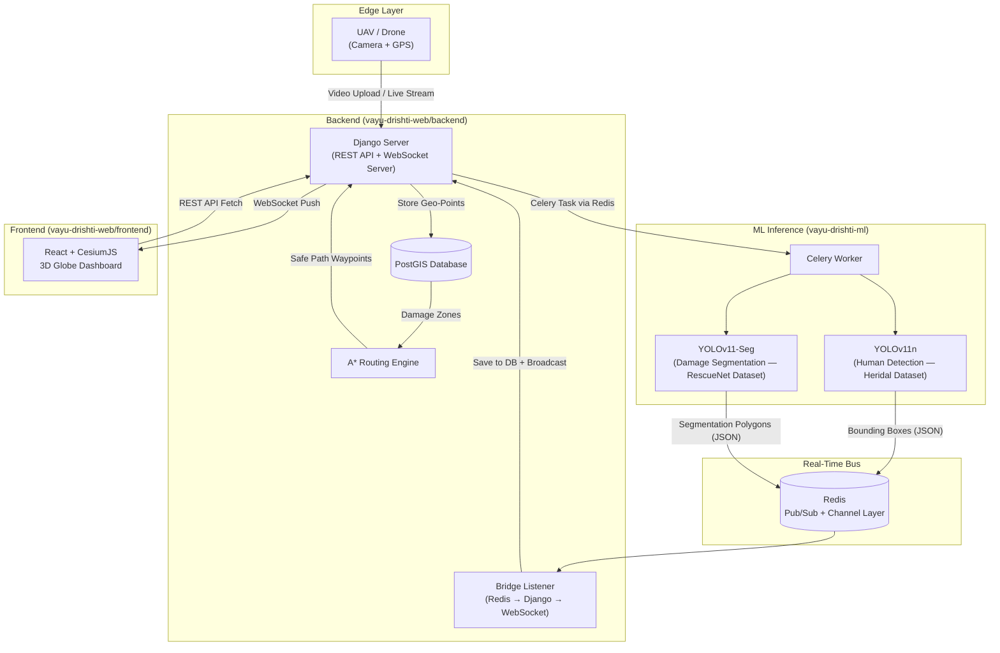
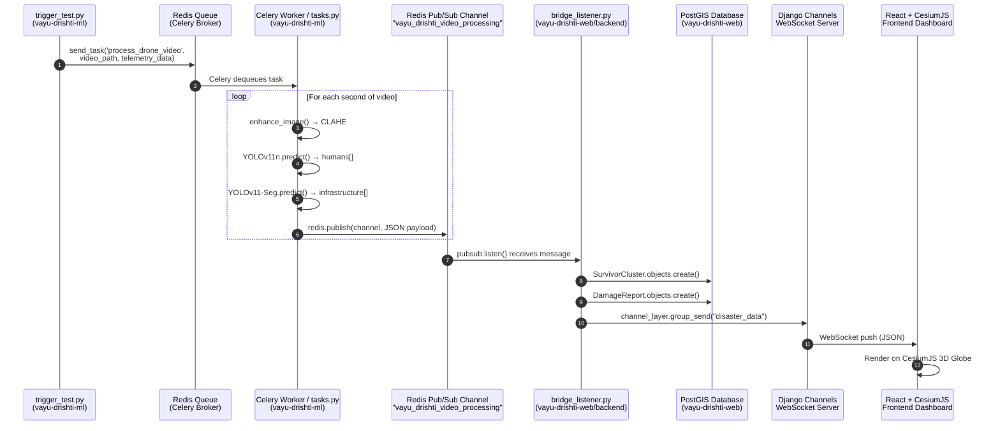

# 🚁 Project Vayu Drishti (AMRIT) — Complete Walkthrough

> **Advanced Management & Rescue using Intelligent Telemetry**  
> A real-time, 3D disaster assessment and management dashboard.

---

## 1. PROJECT OVERVIEW (The 30-Second Pitch)

**Vayu Drishti** is a full-stack disaster management system that:
1. Takes **live drone footage** (or uploaded video files)
2. Runs it through **two YOLO-based ML models simultaneously** — one detects **humans/survivors** (YOLOv11n trained on the Heridal dataset), the other **segments infrastructure damage** (YOLOv11-Seg trained on the RescueNet dataset)
3. **Geo-references** all detections (maps pixel coordinates to real GPS coordinates using the drone's telemetry)
4. Stores everything in a **PostGIS** (geospatial PostgreSQL) database
5. Broadcasts detections **in real time** via **WebSockets** (Django Channels + Redis Pub/Sub) to a **React + CesiumJS 3D globe dashboard**
6. Provides a **Grid-Based A\* routing engine** that calculates the **safest path** for rescue teams, avoiding damage zones with a 20-meter buffer

---

## 2. ARCHITECTURE DIAGRAM



---

## 3. TECH STACK SUMMARY

| Layer | Technology | Purpose |
|-------|-----------|---------|
| **Frontend** | React 19, Resium, CesiumJS | 3D globe rendering, real-time data visualization |
| **Build Tool** | Vite 7, vite-plugin-cesium | Fast dev server, Cesium asset bundling |
| **Backend Framework** | Django 5.2, Django REST Framework | REST API, ASGI server |
| **Real-Time** | Django Channels, Daphne (ASGI) | WebSocket server |
| **Message Broker** | Redis 7 | Pub/Sub between ML↔Backend, Channel Layers |
| **Task Queue** | Celery | Async ML inference job processing |
| **Database** | PostgreSQL + PostGIS | Geospatial data storage (PointField with SRID 4326) |
| **GIS Serialization** | djangorestframework-gis | GeoJSON API responses |
| **ML - Human Detection** | YOLOv11n (Ultralytics) | Object detection (Heridal dataset) |
| **ML - Damage Segmentation** | YOLOv11-Seg (Ultralytics) | Instance segmentation (RescueNet dataset) |
| **Routing** | NetworkX, Shapely, NumPy | Grid-based A* pathfinding |
| **Drone Simulation** | Python asyncio + websockets | Simulated GPS telemetry stream |

---

## 4. FILE-BY-FILE DEEP DIVE

---

### 4.1 ROOT-LEVEL FILES

---

#### `.gitignore`
Standard ignores: `.DS_Store`, `node_modules/`, `__pycache__/`, `*.env`, `venv/`, `db.sqlite3`, `drone_videos/`

---

#### `README.md`
- Describes the project, goals, and tech stack
- Contains **3 sets of setup instructions**:
  1. **Basic mode**: Backend → Frontend → fake_drone.py
  2. **Integration branch** (`feat/integrating`): Adds Celery worker, bridge_listener.py, trigger_test.py
  3. **Routing branch** (`feature/routing-and-drone`): Adds A* routing with RescueNet obstacle avoidance
- Documents the A* algorithm specs: Euclidean heuristic, ~10m grid resolution, ~20m obstacle buffer

---

#### `fake_drone.py` — ⭐ IMPORTANT FILE

**Purpose**: Simulates a drone flying and sending GPS telemetry via WebSocket to the Django server.

**Line-by-line explanation:**

```python
import json, asyncio, websockets, math, sys
```
- Standard imports: `json` for serialization, `asyncio` for async I/O, `websockets` for WS client, `math` for GPS calculations, `sys` for command-line args

```python
uri = "ws://127.0.0.1:8000/ws/telemetry/"
```
- The WebSocket endpoint on the Django server that this fake drone connects to

```python
def generate_mock_telemetry(start_lat, start_lng, duration_sec, bearing_degrees=90, speed_mps=5):
```
- Generates a list of GPS coordinates simulating a straight-line drone flight
- Uses the **Haversine destination point formula** (great-circle navigation)
- `R = 6378137.0` — Earth's radius in meters (WGS-84)
- For each second: calculates the distance traveled (`speed * time`), then uses spherical trigonometry to compute the new lat/lng
- Returns a list of `{timestamp_sec, latitude, longitude, altitude}` dicts

```python
async def fly_drone(start_lat, start_lng, duration_sec, speed_mps, bearing_degrees):
```
- Main async function that connects to the WebSocket and sends one GPS point per second
- Uses `websockets.connect()` with keepalive settings (`ping_interval=10`, `ping_timeout=20`)
- Sends JSON payload: `{latitude, longitude, altitude}`
- `await asyncio.sleep(1.0)` — simulates real-time 1 Hz transmission

```python
if __name__ == "__main__":
```
- Defaults: Start at `17.3850, 78.4867` (Hyderabad), 60 seconds, 5 m/s east
- Accepts optional CLI args: `python fake_drone.py <lat> <lng> <duration>`

---

### 4.2 BACKEND FILES

---

#### `backend/manage.py`
Standard Django management script. Sets `DJANGO_SETTINGS_MODULE` to `amrit_api.settings`. Entry point for all `python manage.py <command>` operations.

---

#### `backend/requirements.txt`
Key dependencies:
- **Django 5.2.11** — Web framework
- **channels 4.3.2 + channels_redis 4.3.0** — WebSocket support
- **daphne 4.2.1** — ASGI server (must be first in INSTALLED_APPS)
- **djangorestframework 3.16.1 + djangorestframework-gis 1.2.0** — REST API with GeoJSON
- **psycopg2-binary 2.9.11** — PostgreSQL adapter
- **redis 7.2.0** — Redis client
- **networkx, shapely, scipy, numpy** — A* routing engine dependencies
- **Twisted 25.5.0** — Async networking (used by Daphne)
- **websockets 16.0** — WebSocket client (for fake_drone.py)

---

#### `backend/amrit_api/settings.py` — ⭐ IMPORTANT FILE

**Line-by-line:**

```python
from dotenv import load_dotenv
```
- Loads `.env` file for database credentials

```python
if platform.system() == 'Darwin':
    GDAL_LIBRARY_PATH = '/opt/homebrew/lib/libgdal.dylib'
    GEOS_LIBRARY_PATH = '/opt/homebrew/lib/libgeos_c.dylib'
elif os.name == 'nt':
    GDAL_LIBRARY_PATH = r'C:/Program Files/PostgreSQL/17/bin/libgdal-35.dll'
```
- **Critical**: PostGIS requires GDAL/GEOS native libraries. This block auto-detects macOS (Homebrew) vs Windows paths

```python
INSTALLED_APPS = [
    "daphne",                   # MUST be first — replaces Django's default runserver with ASGI
    ...
    "django.contrib.gis",       # Enables PostGIS spatial support
    "rest_framework",           # REST API
    "rest_framework_gis",       # GeoJSON serialization
    "channels",                 # WebSocket support
    "corsheaders",              # Cross-Origin (React runs on different port)
    'core',                     # Your main app
]
```

```python
DATABASES = {
    "default": {
        "ENGINE": "django.contrib.gis.db.backends.postgis",  # GeoDjango engine!
        ...
    }
}
```
- Uses `postgis` backend (not standard `postgresql`). This enables `PointField`, spatial queries, etc.

```python
CHANNEL_LAYERS = {
    "default": {
        "BACKEND": "channels_redis.core.RedisChannelLayer",
        "CONFIG": {
            "hosts": [("127.0.0.1", 6379)],
            "capacity": 5000,    # Max messages in channel before oldest dropped
            "expiry": 5,         # Messages expire after 5 seconds (real-time only)
        },
    },
}
```
- Redis-backed channel layer for WebSocket group messaging

```python
CELERY_BROKER_URL = 'redis://localhost:6379/0'
CELERY_RESULT_BACKEND = 'redis://localhost:6379/0'
```
- Celery uses the same Redis instance as its message broker

---

#### `backend/amrit_api/asgi.py` — ⭐ IMPORTANT FILE

```python
application = ProtocolTypeRouter({
    "http": get_asgi_application(),     # Normal HTTP → Django views
    "websocket": AuthMiddlewareStack(   # WebSocket → Django Channels consumers
        URLRouter(websocket_urlpatterns)
    ),
})
```
- **Dual-protocol router**: HTTP requests go to normal Django, WebSocket connections go to Channels consumers
- This is what Daphne runs — it replaces the standard WSGI server

---

#### `backend/amrit_api/urls.py`
```python
urlpatterns = [
    path("admin/", admin.site.urls),      # Django Admin panel
    path("api/", include('core.urls'))    # All REST API endpoints under /api/
]
```

---

#### `backend/amrit_api/consumers.py`
An older/simpler telemetry consumer at the project level. Receives JSON, broadcasts to `'telemetry'` group. **Superseded by the more sophisticated `core/consumers.py`**.

---

#### `backend/amrit_api/routing.py`
Maps `ws/telemetry/` to the project-level `TelemetryConsumer`.
**Note**: The `core/routing.py` is the one actually used (imported by `asgi.py`).

---

### 4.3 CORE APP (backend/core/) — THE HEART OF THE BACKEND

---

#### `core/models.py` — ⭐ CRITICAL FILE

**Three GeoDjango models:**

**1. Drone**
```python
class Drone(models.Model):
    name = models.CharField(max_length=50, unique=True)     # "Alpha-1"
    battery_level = models.IntegerField(default=100)         # 0-100%
    location = models.PointField(srid=4326, null=True)       # GPS point (WGS-84 CRS)
    last_updated = models.DateTimeField(auto_now=True)       # Auto-updates on save
```
- `PointField(srid=4326)` — This is a **PostGIS spatial field**. SRID 4326 = WGS-84 (standard GPS coordinate system)

**2. SurvivorCluster**
```python
class SurvivorCluster(models.Model):
    location = models.PointField(srid=4326)          # Where YOLO detected humans
    estimated_count = models.IntegerField(default=1)  # How many bounding boxes in cluster
    radius_meters = models.FloatField(default=0.0)    # Spread of the cluster
    confidence_score = models.FloatField()             # YOLO confidence (0-100%)
    timestamp = models.DateTimeField(auto_now_add=True) # When detected
    is_rescued = models.BooleanField(default=False)    # Has rescue team reached them?
```
- Represents a group of survivors detected by the YOLOv11n model at a specific GPS location

**3. DamageReport**
```python
DAMAGE_TYPES = [
    ('WATER', 'Water (Natural or Flood)'),
    ('BUILDING_NO_DAMAGE', 'Building - No Damage'),
    ('BUILDING_MINOR_DAMAGE', 'Building - Minor Damage'),
    ('BUILDING_MAJOR_DAMAGE', 'Building - Major Damage'),
    ('BUILDING_TOTAL_DESTRUCTION', 'Building - Total Destruction'),
    ('VEHICLE', 'Vehicle'),
    ('ROAD_CLEAR', 'Road - Clear'),
    ('ROAD_BLOCKED', 'Road - Blocked'),
    ('TREE', 'Tree'),
    ('POOL', 'Pool'),
    ('OTHER', 'Other'),
]
```
- These 11 classes come **directly from the RescueNet dataset** — this is the classification taxonomy the segmentation model outputs
- Each report also has a `severity_level` (LOW/MODERATE/HIGH/CRITICAL) and a `location` PointField

---

#### `core/serializers.py` — ⭐ IMPORTANT FILE

```python
class SurvivorClusterSerializer(GeoFeatureModelSerializer):
    class Meta:
        model = SurvivorCluster
        geo_field = "location"
        fields = ['id', 'estimated_count', 'radius_meters', 'confidence_score', 'timestamp', 'is_rescued']
```
- `GeoFeatureModelSerializer` — from `djangorestframework-gis`. Outputs data as **GeoJSON FeatureCollection** (standard geospatial format)
- The `geo_field = "location"` tells it to serialize the `PointField` as GeoJSON geometry
- API response looks like:
```json
{
  "type": "FeatureCollection",
  "features": [
    {
      "type": "Feature",
      "geometry": {"type": "Point", "coordinates": [78.48, 17.38]},
      "properties": {"id": 1, "estimated_count": 5, "confidence_score": 87.3, ...}
    }
  ]
}
```

---

#### `core/views.py` — ⭐ CRITICAL FILE

**Three main components:**

**1. ViewSets (REST API for map data)**
```python
class SurvivorClusterViewSet(viewsets.ReadOnlyModelViewSet):
    queryset = SurvivorCluster.objects.all()
    serializer_class = SurvivorClusterSerializer
```
- `ReadOnlyModelViewSet` — auto-generates `GET /api/survivors/` (list) and `GET /api/survivors/<id>/` (detail)
- Same pattern for `DamageReportViewSet`

**2. Video Upload Handler**
```python
@api_view(['POST'])
def handle_video_upload(request):
```
- Accepts a video file via multipart POST
- Saves it to `drone_videos/` folder
- Generates mock telemetry using `utils.py` (fake GPS path)
- Pushes a Celery task `'process_drone_video'` to Redis
- Returns HTTP 202 (Accepted) with the task ID

**3. A\* Routing Engine** — `build_safe_path()` — ⭐ CRITICAL FUNCTION

This is the **Grid-Based A\* pathfinding algorithm**. Line by line:

```python
def build_safe_path(start_coord, end_coord, damage_reports):
```

**Step 1 — Bounding Box:**
```python
min_lng = min(start_coord[0], end_coord[0])
# ... adds 0.005 (~500m) padding on all sides
```
- Creates a bounding box around start/end points with 500m padding to allow routing around obstacles

**Step 2 — Grid Creation:**
```python
grid_res = 0.0001  # ~10 meters per cell
lons = np.arange(min_lng, max_lng + grid_res, grid_res)
lats = np.arange(min_lat, max_lat + grid_res, grid_res)
```
- Discretizes the geographic area into a grid where each cell ≈ 10m × 10m

**Step 3 — Obstacle Generation:**
```python
SAFE_CLASSES = ['BUILDING_NO_DAMAGE', 'ROAD_CLEAR']
for report in damage_reports:
    if report.damage_type not in SAFE_CLASSES:
        report_point = Point(report.location.x, report.location.y)
        obstacle_polygons.append(report_point.buffer(0.0002))  # ~20m buffer
```
- Every damage report that is NOT safe gets a **20-meter circular buffer** around it
- These become impassable zones in the routing grid

**Step 4 — R-Tree Spatial Index:**
```python
tree = STRtree(obstacle_polygons)
```
- `STRtree` from Shapely — a **Sort-Tile-Recursive tree** for O(log n) spatial queries instead of O(n)

**Step 5 — Graph Construction:**
```python
G = nx.Graph()
for i in range(len(lons)):
    for j in range(len(lats)):
        point = Point(lons[i], lats[j])
        if not tree.query(point).size > 0:  # Not inside any obstacle
            G.add_node((i, j), pos=(lons[i], lats[j]))
```
- Only adds grid nodes that don't intersect with obstacle buffers

**Step 6 — 8-Connected Edges:**
```python
neighbors = [(i+1,j), (i-1,j), (i,j+1), (i,j-1), (i+1,j+1), (i+1,j-1), (i-1,j+1), (i-1,j-1)]
```
- Each node connects to 8 neighbors (horizontal, vertical, diagonal)
- Edge weight = Euclidean distance

**Step 7 — A\* Search:**
```python
def heuristic(a, b):
    return np.sqrt((p1[0]-p2[0])**2 + (p1[1]-p2[1])**2)  # Euclidean distance

path = nx.astar_path(G, start, end, heuristic=heuristic, weight='weight')
```
- Uses NetworkX's built-in A\* implementation with Euclidean heuristic
- Returns the coordinate path, which gets serialized as `[{lat, lng}, ...]` JSON

**The `calculate_route` API view:**
```python
@api_view(['POST'])
def calculate_route(request):
```
- Receives `start_lat, start_lng, end_lat, end_lng` from frontend
- Fetches ALL DamageReports from PostGIS
- Calls `build_safe_path()` and returns the JSON path or a 404 if no safe path exists

---

#### `core/urls.py`
```python
router = DefaultRouter()
router.register(r'survivors', SurvivorClusterViewSet)   # GET /api/survivors/
router.register(r'damage', DamageReportViewSet)          # GET /api/damage/
urlpatterns = [
    path('', include(router.urls)),
    path('upload-video/', handle_video_upload),            # POST /api/upload-video/
    path('route/', calculate_route),                       # POST /api/route/
]
```

---

#### `core/consumers.py` — ⭐ CRITICAL FILE

**Two WebSocket consumers:**

**1. DroneTelemetryConsumer** — handles `ws://127.0.0.1:8000/ws/telemetry/`
```python
class DroneTelemetryConsumer(AsyncWebsocketConsumer):
    async def connect(self):
        self.room_group_name = "deone_telemetry"  # Note: typo in group name, but consistent
        await self.channel_layer.group_add(self.room_group_name, self.channel_name)
        await self.accept()
```
- When a client (drone or dashboard) connects, it joins the `"deone_telemetry"` group

```python
    async def receive(self, text_data):
        payload = json.loads(text_data)
        await self.channel_layer.group_send(self.room_group_name, {
            'type': 'broadcast_telemetry', 'data': payload
        })
        self.message_counter += 1
        if self.message_counter >= 50:
            await self.save_drone_location(payload)
            self.message_counter = 0
```
- **Broadcasts** every received message to all connected clients (so the React dashboard gets it)
- **Throttled DB save**: Only writes to PostgreSQL every 50th message (prevents DB hammering at 10 Hz)

**2. DisasterConsumer** — handles `ws://127.0.0.1:8000/ws/disaster/`
```python
class DisasterConsumer(AsyncWebsocketConsumer):
    async def connect(self):
        await self.channel_layer.group_add("disaster_data", self.channel_name)
        await self.accept()

    async def send_disaster_update(self, event):
        await self.send(text_data=json.dumps(event["payload"]))
```
- Clients join the `"disaster_data"` group
- When the bridge_listener broadcasts to this group, this consumer forwards the data to connected browsers
- The method name `send_disaster_update` **must exactly match** the `"type"` field in bridge_listener's `group_send` call

---

#### `core/routing.py`
```python
websocket_urlpatterns = [
    re_path(r'ws/telemetry/$', consumers.DroneTelemetryConsumer.as_asgi()),
    re_path(r'ws/disaster/$', consumers.DisasterConsumer.as_asgi()),
]
```
- Maps WebSocket URLs to their consumers. This is imported by `asgi.py`.

---

#### `core/admin.py`
```python
@admin.register(Drone)
class DroneAdmin(admin.GISModelAdmin):
    list_display = ('name', 'battery_level', 'last_updated')
```
- Registers all 3 models in Django Admin with `GISModelAdmin` (which renders maps for PointFields)
- Adds filters: `is_rescued` for survivors, `damage_type`/`severity_level` for damage

---

#### `core/utils.py`
Same Haversine destination-point formula as `fake_drone.py`. Used server-side by `handle_video_upload` to generate mock telemetry when a video is uploaded (since the video doesn't have real GPS metadata).

---

#### `core/management/commands/seed_disaster.py`
```python
class Command(BaseCommand):
    def handle(self, *args, **kwargs):
        SurvivorCluster.objects.all().delete()
        DamageReport.objects.all().delete()
        for i in range(50):
            # Random offsets around Godavarikhani (18.76, 79.48)
            # 50/50 chance: create SurvivorCluster or DamageReport
```
- Django management command: `python manage.py seed_disaster`
- Clears existing data and generates 50 random disaster events for testing

> [!WARNING]
> The seed command uses old damage types (`FIRE`, `FLOOD`, `COLLAPSE`, `ROAD_BLOCK`) which were from migration 0001. The model was updated in migration 0003 to use RescueNet classes. This seed command would need updating to use valid RescueNet classes for full compatibility.

---

#### Database Migrations

- **0001_initial.py** (2026-02-22): Created `DamageReport`, `Drone`, `SurvivorCluster` tables. Original damage types were `FIRE, FLOOD, COLLAPSE, ROAD_BLOCK, OTHER`
- **0002** (2026-02-23): Fixed typo — renamed `confidece_score` → `confidence_score`
- **0003** (2026-03-22): **Major change** — replaced damage types with RescueNet classes (WATER, BUILDING_NO_DAMAGE, BUILDING_MINOR_DAMAGE, etc.). Also increased `max_length` from 20 to 50.

---

#### `backend/bridge_listener.py` — ⭐ CRITICAL FILE

**Purpose**: The **bridge between the ML pipeline and the Django web app**. Subscribes to Redis, saves detections to PostGIS, and broadcasts them via WebSocket.

```python
# 1. FORCE WINDOWS TO SEE THE GDAL DLLs
gdal_path = r'C:\Program Files\PostgreSQL\17\bin'
if gdal_path not in os.environ['PATH']:
    os.environ['PATH'] = gdal_path + os.pathsep + os.environ['PATH']
```
- Windows-specific GDAL path fix (runs before Django setup)

```python
# Setup Django environment (so we can use ORM)
os.environ.setdefault('DJANGO_SETTINGS_MODULE', 'amrit_api.settings')
django.setup()
```

```python
COLOR_MAP = {
    'WATER': '#1E90FF',
    'BUILDING_NO_DAMAGE': '#32CD32',
    'BUILDING_MINOR_DAMAGE': '#FFD700',
    'BUILDING_MAJOR_DAMAGE': '#FF8C00',
    'BUILDING_TOTAL_DESTRUCTION': '#8B0000',
    'VEHICLE': '#8A2BE2',
    'ROAD_CLEAR': '#A9A9A9',
    'ROAD_BLOCKED': '#FF0000',
    'TREE': '#228B22',
    'POOL': '#00BFFF',
    'OTHER': '#808080'
}
```
- Color-codes each RescueNet class for the frontend map overlay

```python
def start_bridge():
    r = redis.Redis(host='localhost', port=6379, db=0)
    pubsub = r.pubsub()
    pubsub.subscribe('vayu_drishti_video_processing')
```
- Connects to Redis and subscribes to the channel that the ML worker publishes to

```python
    for message in pubsub.listen():
        data = json.loads(message['data'])
        lat = data['location']['lat']
        lng = data['location']['lng']
        point = Point(lng, lat, srid=4326)
```
- Infinite loop listening for messages
- Extracts GPS coordinates and creates a GeoDjango `Point` object

**Survivor processing:**
```python
        if data['humans']:
            SurvivorCluster.objects.create(
                location=point,
                estimated_count=len(data['humans']),
                confidence_score=round(max(h['conf'] for h in data['humans']) * 100, 2),
                ...
            )
            # Then broadcasts via WebSocket:
            channel_layer.group_send("disaster_data", {
                "type": "send_disaster_update",
                "payload": {"type": "SURVIVOR", "lat": lat, "lng": lng, ...}
            })
```
- Saves survivors to PostGIS with count and highest confidence score
- Broadcasts to the `"disaster_data"` WebSocket group

**Damage processing:**
```python
        for infra in data['infrastructure']:
            d_type = infra['class'].upper().replace('-', '_').replace(' ', '_')
            # Validates against Django model choices
            DamageReport.objects.create(location=point, damage_type=d_type, ...)
            # Broadcasts with zone color from COLOR_MAP
```

---

### 4.4 FRONTEND FILES

---

#### `frontend/package.json`
Key dependencies:
- **cesium ^1.138.0** — 3D globe rendering engine
- **react ^19.2.0** — UI framework
- **resium ^1.19.4** — React bindings for CesiumJS (declarative `<Entity>`, `<Viewer>` components)
- **vite-plugin-cesium** — Auto-copies Cesium static assets during build

---

#### `frontend/vite.config.js`
```javascript
export default defineConfig({
  plugins: [react(), cesium()],
})
```
- `cesium()` plugin handles the complex Cesium asset bundling (workers, styles, imagery)

---

#### `frontend/src/main.jsx`
```jsx
createRoot(document.getElementById('root')).render(
  <StrictMode>
    <App />
  </StrictMode>,
)
```
- Standard React 19 entry point using `createRoot` API

---

#### `frontend/src/hooks/useWebSocket.js` — ⭐ IMPORTANT FILE

```javascript
const useWebSocket = (url) => {
  const [data, setData] = useState(null);

  useEffect(() => {
    const socket = new WebSocket(url);
    socket.onmessage = (event) => {
      const parsedData = JSON.parse(event.data);
      setData(parsedData);
    };
    return () => socket.close();  // Cleanup on unmount
  }, [url]);

  return data;
};
```
- Custom React hook that manages a single WebSocket connection
- Returns the latest parsed JSON message as state
- Auto-reconnects if URL changes (via dependency array)

---

#### `frontend/src/App.jsx` — ⭐ MOST CRITICAL FRONTEND FILE

**State declarations:**
```jsx
const [disasterEvents, setDisasterEvents] = useState([]);    // Initial DB load
const [liveSurvivors, setLiveSurvivors] = useState([]);      // Real-time YOLO detections
const [liveDamage, setLiveDamage] = useState([]);             // Real-time segmentation
const [esriProvider, setEsriProvider] = useState(null);       // Satellite map tiles
const [routePath, setRoutePath] = useState([]);               // A* computed route
```

**WebSocket connections:**
```jsx
const telemetry = useWebSocket('ws://127.0.0.1:8000/ws/telemetry/');
const disasterUpdate = useWebSocket('ws://127.0.0.1:8000/ws/disaster/');
```
- Two simultaneous WebSocket connections: one for drone GPS, one for ML detections

**Satellite Imagery:**
```jsx
const provider = await Cesium.ArcGisMapServerImageryProvider.fromUrl(
    'https://services.arcgisonline.com/ArcGIS/rest/services/World_Imagery/MapServer'
);
```
- Uses Esri ArcGIS World Imagery (free satellite tiles) instead of Bing Maps (which requires API key)

**Initial Data Fetch:**
```jsx
const response = await fetch('http://127.0.0.1:8000/api/survivors/');
const data = await response.json();
setDisasterEvents(data.features || []);
```
- On mount, fetches all historical survivors from the REST API

**Real-Time Handler:**
```jsx
useEffect(() => {
    if (!disasterUpdate) return;
    if (disasterUpdate.type === "SURVIVOR") {
        setLiveSurvivors((prev) => [...prev, disasterUpdate]);
    } else if (disasterUpdate.type === "DAMAGE") {
        setLiveDamage((prev) => [...prev, disasterUpdate]);
    }
}, [disasterUpdate]);
```
- Appends each incoming WebSocket message to the appropriate array

**Drone position (real-time):**
```jsx
const dronePosition = useMemo(() => {
    if (telemetry?.latitude && telemetry?.longitude) {
        return Cartesian3.fromDegrees(telemetry.longitude, telemetry.latitude, telemetry.altitude || 100);
    }
    return Cartesian3.fromDegrees(78.4867, 17.3850, 100);  // Default Hyderabad
}, [telemetry]);
```
- Converts lat/lng to Cesium's `Cartesian3` (3D world coordinates) whenever telemetry updates

**Route Request Handler:**
```jsx
const handleRouteRequest = async (survivor) => {
    const rescueBase = { lat: 17.3840, lng: 78.4850 };
    const response = await fetch('http://127.0.0.1:8000/api/route/', {
        method: 'POST',
        body: JSON.stringify({ start_lat, start_lng, end_lat, end_lng })
    });
    const routeCartesians = data.path.map(p => Cartesian3.fromDegrees(p.lng, p.lat));
    setRoutePath(routeCartesians);
};
```

**The JSX renders 6 entity layers on the Cesium globe:**
1. **Drone entity** (red dot + "Alpha-1" label, tracks camera)
2. **Historical events** (yellow dots from initial DB load)
3. **Live survivors** (red dots from YOLO WebSocket)
4. **Live damage zones** (colored rectangles ~20m×20m from segmentation WebSocket)
5. **Safe route polyline** (glowing cyan line from A*)
6. **Rescue base station** (blue dot at fixed coordinates)

---

#### `frontend/src/components/LeftSideBar.jsx` — ⭐ IMPORTANT FILE (FILTER BUG FIXED)

**Filters section (now working):**
```jsx
<input type="checkbox" checked={filters.showSurvivors}
       onChange={(e) => onFilterChange('showSurvivors', e.target.checked)} /> Survivor Clusters
<input type="checkbox" checked={filters.showDamage}
       onChange={(e) => onFilterChange('showDamage', e.target.checked)} /> Damage Reports
<input type="checkbox" checked={filters.showDrones}
       onChange={(e) => onFilterChange('showDrones', e.target.checked)} /> Active Drones
```
- These checkboxes are now **controlled components** — bound to React state via `filters` prop
- Toggling them calls `onFilterChange()` which propagates up to `App.jsx` and conditionally renders the map layers

**Emergency Routing section:**
- Lists all `liveSurvivors` with a "Calculate Safe Route" button per cluster
- Calls `onRouteRequest(survivor)` which triggers the A* API call

---

#### `frontend/src/components/RightSidebar.jsx`
- Shows the "Fleet Manager" panel with drone status card
- Displays live telemetry: LAT, LON, STATUS (IN-FLIGHT / SEARCHING)
- Shows a fake "Live Camera Feed" box with a CRT scanline effect
- Clicking the drone card toggles camera tracking (`setIsTracked(true)`)

---

#### `frontend/src/components/Color.jsx`
A simple utility component that maps label names to hex colors. **Not actually imported or used** in the main App — appears to be an early prototype/unused file.

---

### 4.5 ML PIPELINE FILES (vayu-drishti-ml — separate repo)

> [!IMPORTANT]
> These files live in a **separate repository** called `vayu-drishti-ml`. They are NOT inside the `vayu-drishti-web` repo. The two repos communicate solely through **Redis** — the ML repo publishes detection results to a Redis Pub/Sub channel, and the web repo's `bridge_listener.py` subscribes to that channel. See **Section 9** below for the full cross-repo connection diagram.

---

#### `tasks.py` — ⭐ CRITICAL ML FILE (Full Line-by-Line)

**Imports and Setup:**
```python
import torch
from ultralytics import YOLO
import base64, json, cv2, numpy as np, redis
from celery import Celery
```
- `torch` — PyTorch (needed to check CUDA availability for GPU acceleration)
- `ultralytics` — The Ultralytics YOLOv11 library (pre-built, not written by you)
- `cv2` (OpenCV) — Image/video decoding and CLAHE enhancement
- `celery` — Distributed task queue framework

```python
app = Celery('vayu_drishti_ml', broker='redis://localhost:6379/0')
redis_client = redis.Redis(host='localhost', port=6379, db=0)
```
- `app` — Celery application instance. `'vayu_drishti_ml'` is the app name. `broker='redis://...'` tells Celery to use Redis as the message broker (where tasks are queued)
- `redis_client` — A direct Redis connection for publishing results via Pub/Sub (separate from Celery's internal queue)

```python
print("Loading Vayu-Drishti AI Models in VRAM...")
human_model = YOLO('models/human_detector.pt')
infra_model = YOLO('models/infra_segmenter.pt')
print("Models loaded successfully... Waiting for frames...")
```
- Loads both models **at startup** (module-level) so they stay in GPU VRAM permanently
- `human_detector.pt` — YOLOv11n weights trained on the **Heridal** dataset (human detection)
- `infra_segmenter.pt` — YOLOv11-Seg weights trained on the **RescueNet** dataset (damage segmentation)

> [!IMPORTANT]
> **These lines use the Ultralytics YOLO library**. The `YOLO()` constructor, `.predict()` method, result objects (`.boxes`, `.masks`, `.xyxyn`, `.conf`, `.cls`, `.xyn`) — **all of this is pre-built Ultralytics/YOLOv11 API code**. You did NOT write the YOLO inference engine. You loaded your custom-trained `.pt` model weights and called the standard Ultralytics predict API.

```python
USE_HALF = torch.cuda.is_available()
```
- **FP16 half-precision optimization**: If a CUDA-compatible GPU is detected, this enables half-precision (16-bit float) inference. This **doubles throughput** and **halves VRAM usage** with negligible accuracy loss. On CPU-only systems it stays as FP32 to avoid numerical errors.

---

**`enhance_image()` — CLAHE Image Enhancement (custom code):**

```python
def enhance_image(frame):
    lab = cv2.cvtColor(frame, cv2.COLOR_BGR2LAB)
```
- Converts the BGR image to **LAB color space** (L=Lightness, A=green-red, B=blue-yellow). This separates brightness from color, so we can enhance contrast on the lightness channel without distorting colors.

```python
    l_channel, a, b = cv2.split(lab)
```
- Splits into 3 channels. We only want to modify `l_channel`.

```python
    clahe = cv2.createCLAHE(clipLimit=2.0, tileGridSize=(8,8))
    cl = clahe.apply(l_channel)
```
- **CLAHE** = Contrast Limited Adaptive Histogram Equalization
- Unlike global histogram equalization (which over-amplifies noise), CLAHE divides the image into **8×8 tiles** and equalizes each independently
- `clipLimit=2.0` — prevents over-amplification in near-constant regions (clips histogram to prevent noise boost)
- **Why this matters for drone footage**: Aerial images often have severe shadows from buildings, uneven lighting, and haze. CLAHE dynamically brightens dark areas (shadows under rubble, people in shade) and enhances edges, dramatically improving small object detection **without** the compute cost of tiling/SAHI approaches.

```python
    limg = cv2.merge((cl, a, b))
    return cv2.cvtColor(limg, cv2.COLOR_LAB2BGR)
```
- Merges the enhanced lightness back with original color channels and converts back to BGR

> [!NOTE]
> `enhance_image()` is 100% **your custom code** — it's NOT from the YOLO library. It's a computer vision preprocessing step you added to improve detection in challenging aerial conditions.

---

**Task 1: `process_drone_frame`** (for live stream — full line-by-line)

```python
@app.task(name='process_drone_frame')
def process_drone_frame(base64_frame, drone_id):
```
- `@app.task` — Registers this function as a Celery task. When another service calls `app.send_task('process_drone_frame', ...)`, Celery routes it here.
- `name='process_drone_frame'` — The task's registered name in the Redis queue

```python
    img_data = base64.b64decode(base64_frame)
    np_arr = np.frombuffer(img_data, np.uint8)
    frame = cv2.imdecode(np_arr, cv2.IMREAD_COLOR)
```
- **Step 1**: Decodes a base64-encoded image string back into raw bytes, then into a NumPy array, then into an OpenCV BGR image. This is how image data is transmitted over the network in JSON-safe format.

```python
    enhanced_frame = enhance_image(frame)
```
- **Step 2**: Applies the CLAHE contrast enhancement before YOLO inference

```python
    h_results = human_model.predict(enhanced_frame, conf=0.15, iou=0.45, half=USE_HALF, verbose=False)[0]
    i_results = infra_model.predict(enhanced_frame, conf=0.35, iou=0.45, retina_masks=True, half=USE_HALF, verbose=False)[0]
```
- **Step 3**: Runs BOTH models on the enhanced frame:
  - `conf=0.15` — **Very low confidence threshold (15%)** for human detection. This catches faint/partial/occluded humans that higher thresholds would miss. Better to have false positives than miss a survivor.
  - `conf=0.35` — **35% threshold** for infrastructure. Slightly higher because segmentation false positives create routing obstacles.
  - `iou=0.45` — **Non-Maximum Suppression (NMS) IoU threshold**. If two detections overlap by >45%, the lower-confidence one is suppressed. Prevents duplicate detections.
  - `half=USE_HALF` — FP16 inference if GPU available (2× speed)
  - `retina_masks=True` — **High-resolution segmentation masks**. Default YOLO masks are downscaled to the feature map resolution (~160px). Retina masks upsample back to the original image resolution, giving much tighter polygon boundaries.
  - `verbose=False` — Suppresses per-frame terminal spam
  - `[0]` — `.predict()` returns a list (one result per image in batch). We only pass one image, so take `[0]`.

> [!NOTE]
> **YOLO API code you didn't write**: `.predict()`, `conf=`, `iou=`, `half=`, `retina_masks=`, `.boxes`, `.xyxyn`, `.conf`, `.masks.xyn`, `.boxes.cls`, `.names[]` — all standard Ultralytics inference API parameters and result accessors.

```python
    payload = {
        "drone_id": drone_id,
        "humans" : [],
        "infrastructure": []
    }
```
- **Step 4**: Initialize the JSON payload structure

```python
    for box in h_results.boxes:
        x1, y1, x2, y2 = box.xyxyn[0].tolist()
        payload["humans"].append({
            "box": [x1, y1, x2, y2],
            "conf": float(box.conf[0])
        })
```
- Iterates over every detected human bounding box
- `xyxyn` — Normalized coordinates (0.0 to 1.0 relative to image dimensions). This makes them resolution-independent.
- Appends box coordinates + confidence to the payload

```python
    if i_results.masks is not None:
        for i, mask in enumerate(i_results.masks.xyn):
            cls_id = int(i_results.boxes.cls[i])
            payload["infrastructure"].append({
                "class": infra_model.names[cls_id],
                "polygon": mask.tolist()
            })
```
- If segmentation found any masks, iterate over each mask's normalized polygon points
- `cls_id` — Gets the integer class ID (e.g., 0, 1, 2...)
- `infra_model.names[cls_id]` — Translates class ID to human-readable label (e.g., "Building-Major-Damage")
- `mask.tolist()` — Converts the NumPy polygon array to a regular Python list for JSON serialization

```python
    channel_name = f"drone_{drone_id}_telemetry"
    redis_client.publish(channel_name, json.dumps(payload))
```
- Publishes the JSON payload directly to a drone-specific Redis Pub/Sub channel

---

**Task 2: `process_drone_video`** (for uploaded video files — full line-by-line)

```python
@app.task(name='process_drone_video')
def process_drone_video(video_path, telemetry_data):
```
- Celery task that processes a full video file (not a single frame)
- `video_path` — Absolute path to the video file on disk
- `telemetry_data` — List of `{timestamp_sec, lat, lng}` dicts (the mock GPS flight path)

```python
    cap = cv2.VideoCapture(video_path)
    if not cap.isOpened():
        return f"Error: Could not open video file at {video_path}"
    fps = cap.get(cv2.CAP_PROP_FPS)
    if fps == 0 or fps is None: 
        fps = 30  # Fallback if metadata stripped
```
- Opens the video with OpenCV. Gets the native FPS (e.g., 30 FPS). Falls back to 30 if metadata is missing.

```python
    while cap.isOpened():
        ret, frame = cap.read()
        if not ret: break
        if frame_count % int(fps) == 0:  # Process only 1 frame per second
```
- Reads every frame but only processes 1 per second. For a 30 FPS video, it processes frame 0, 30, 60, etc. This saves ~97% compute.

```python
            current_second = int(frame_count / fps)
            drone_location = next((item for item in telemetry_data 
                if int(item["timestamp_sec"]) == current_second), None)
```
- Calculates which second of video we're at
- Looks up the corresponding GPS coordinate from the telemetry data (generated by `trigger_test.py`)

```python
            if drone_location:
                enhanced_frame = enhance_image(frame)
                h_results = human_model.predict(enhanced_frame, conf=0.15, iou=0.45, half=USE_HALF, verbose=False)[0]
                i_results = infra_model.predict(enhanced_frame, conf=0.35, iou=0.45, retina_masks=True, half=USE_HALF, verbose=False)[0]
```
- Applies CLAHE enhancement, then runs BOTH models with same optimized parameters as `process_drone_frame`

```python
                payload = {
                    "source": "video_batch",
                    "timestamp_sec": current_second,
                    "location": {
                        "lat": drone_location['lat'], 
                        "lng": drone_location['lng']
                    },
                    "humans": [],
                    "infrastructure": []
                }
```
- Payload includes the **GPS location** — this is how pixel detections become geographic points

```python
                if payload["humans"] or payload["infrastructure"]:
                    channel_name = "vayu_drishti_video_processing"
                    redis_client.publish(channel_name, json.dumps(payload))
```
- Only publishes if detections were found. Publishes to `vayu_drishti_video_processing` — **this is the exact channel that `bridge_listener.py` in the web repo subscribes to!**

---

#### `trigger_test.py` — ML Trigger Script (Full Line-by-Line)

**Purpose**: This is the **entry point** that kicks off the entire ML pipeline. You run this script manually to submit a video for processing.

```python
import math
from celery import Celery
```
- `math` for the Haversine GPS calculations, `Celery` to connect to the task queue

```python
app = Celery('vayu_drishti_ml', broker='redis://localhost:6379/0')
```
- Creates a Celery client (not a worker!) connected to the same Redis broker. This lets us **submit tasks** to the queue for the worker (running `tasks.py`) to pick up.

```python
def generate_mock_telemetry(start_lat, start_lng, duration_sec, bearing_degrees=90, speed_mps=5):
    telemetry = []
    R = 6378137.0  # Earth's radius in meters (WGS-84 datum)
    for sec in range(int(duration_sec) + 1): 
        distance = speed_mps * sec
        lat1, lon1, brng = map(math.radians, [start_lat, start_lng, bearing_degrees])
```
- `R = 6378137.0` — Earth's equatorial radius in meters, per the WGS-84 standard (same datum used by GPS satellites)
- Converts starting coordinates and bearing to radians for trig functions
- `bearing_degrees=90` means flying due East

```python
        lat2 = math.asin(math.sin(lat1) * math.cos(distance / R) +
                         math.cos(lat1) * math.sin(distance / R) * math.cos(brng))
        lon2 = lon1 + math.atan2(math.sin(brng) * math.sin(distance / R) * math.cos(lat1),
                                 math.cos(distance / R) - math.sin(lat1) * math.sin(lat2))
```
- **Haversine destination point formula** — given a start point, bearing, and distance, computes the destination lat/lng on a sphere
- This is standard geodesic math, NOT an approximation — it accounts for Earth's curvature

```python
        telemetry.append({
            "timestamp_sec": float(sec),
            "lat": round(math.degrees(lat2), 7),
            "lng": round(math.degrees(lon2), 7)
        })
```
- Converts back to degrees and rounds to 7 decimal places (~1.1cm precision)
- Each entry maps a specific second of video to a specific GPS coordinate

```python
import sys

if len(sys.argv) > 1:
    VIDEO_PATH = sys.argv[1]
else:
    VIDEO_PATH = "C:/Users/vadhu/Amogh/MajorProject/destroyed_town.mp4"  # Fallback
```
- **Accepts command-line argument** for the video path: `python trigger_test.py /path/to/video.mp4`
- Falls back to a hardcoded path if no argument is provided

```python
DURATION = 20   # Length of the video in seconds
START_LAT = 17.3850   # Hyderabad coordinates
START_LNG = 78.4867
```

```python
if __name__ == "__main__":
    print(f"🚀 Manually triggering Vayu-Drishti-ML OPTIMIZED for: {VIDEO_PATH}")
    telemetry = generate_mock_telemetry(START_LAT, START_LNG, DURATION)
```
- Generates 21 GPS points (second 0 through second 20) simulating a drone flying east from Hyderabad at 5 m/s

```python
    app.send_task(
        'process_drone_video', 
        kwargs={
            'video_path': VIDEO_PATH, 
            'telemetry_data': telemetry
        }
    )
    print("✅ Video Batch Task sent to Redis! Check your Celery worker terminal.")
```
- `app.send_task()` — Submits the task to Redis (NOT executing it locally). The Celery worker process (running `tasks.py`) will dequeue and execute it.
- `kwargs` — Passes the video path and telemetry as keyword arguments to `process_drone_video()`

---

### 4.6 PAPER/DOCUMENTATION SCRIPTS (Helper Scripts)

These are **utility scripts** used to generate the IEEE research paper and its assets. They are NOT part of the running application.

| Script | Purpose |
|--------|---------|
| `generate_paper.py` | Creates `Vayu_Drishti_Research_Paper.docx` in IEEE two-column format with inline images |
| `generate_assets.py` | Generates matplotlib graphs (YOLOv11n loss, RescueNet mIoU) + pydot architecture diagram |
| `generate_assets_new.py` | Enhanced version: creates Mermaid `.mmd` diagrams + dual-axis training graphs |
| `generate_mermaid_diagrams.py` | Creates 3 Mermaid files (arch, ML pipeline, WS flow) and converts to PNG via `mmdc` |
| `regen_visuals.py` | Regenerates the Mermaid diagrams with better styling (larger fonts, colored nodes) |
| `generate_readme.py` | Auto-reviews the .docx file for missing content (A* routing, Django) and generates `assets/README.md` |
| `rewrite_doc.py` | Rewrites an existing brain-to-text paper into the Vayu Drishti format (text replacement + table updates) |
| `evaluate_doc.py` | Scans .docx for figure placeholders and keyword frequency analysis |
| `add_routing.py` | Injects the A* routing section before "RESULTS AND ANALYSIS" in the IEEE paper |
| `insert_diagrams.py` | Replaces `Fig.1:`, `Fig.2:` placeholders with actual PNG images |
| `insert_all_visuals.py` | Extended version — handles all 5 figures at larger scale |
| `insert_visuals_new.py` | Inserts images before caption text (for `assets/` folder images) |

---

## 5. COMPLETE EXECUTION FLOW

Here's what happens when the entire system runs:

```
Step 1: Start Redis                       → docker run -p 6379:6379 -d redis:7
Step 2: Start Django (ASGI/Daphne)        → cd backend && python manage.py runserver
Step 3: Start Celery Worker               → cd vayu-drishti-ml && celery -A tasks worker
Step 4: Start Bridge Listener             → cd backend && python bridge_listener.py
Step 5: Start React Dashboard             → cd frontend && npm run dev
Step 6: Trigger ML Processing             → cd vayu-drishti-ml && python trigger_test.py
```

**Data flow:**
1. `trigger_test.py` sends a Celery task to Redis with the video path + telemetry
2. The Celery worker (`tasks.py`) picks it up, opens the video
3. For each second of video: runs YOLOv11n + YOLOv11-Seg
4. Publishes JSON detections to Redis channel `vayu_drishti_video_processing`
5. `bridge_listener.py` receives the message from Redis
6. Saves `SurvivorCluster` and `DamageReport` to PostGIS
7. Broadcasts via Django Channels to the `"disaster_data"` WebSocket group
8. React dashboard receives the WebSocket message
9. `App.jsx` appends to `liveSurvivors[]` or `liveDamage[]`
10. CesiumJS renders new entities on the 3D globe in real time

---

## 6. THE FILTER BUG — DIAGNOSIS AND FIX ✅ (RESOLVED)

### The Problem
In `LeftSideBar.jsx`, there were 3 filter checkboxes:
- "Survivor Clusters"
- "Damage Reports"
- "Active Drones"

They used `defaultChecked` (uncontrolled components) and were **not connected to any state or callback**. Toggling them had zero effect on the map.

### The Root Cause
`App.jsx` rendered **all** entities unconditionally. The checkboxes needed to:
1. Be controlled by React state
2. Pass filter state up to `App.jsx`
3. `App.jsx` needed to conditionally render entity layers based on filter state

### The Fix (Applied)
- **`App.jsx`**: Added `filters` state (`{showSurvivors, showDamage, showDrones}`) + `handleFilterChange()` handler. All entity renders are now wrapped in `{filters.showX && ...}` conditionals.
- **`LeftSideBar.jsx`**: Changed from `defaultChecked` to controlled `checked={filters.showX}` + `onChange` callbacks. Now receives `filters` and `onFilterChange` props.
- Unchecking any filter instantly hides the corresponding map layer.

---

## 7. WHERE YOLO CODE WAS USED (NOT WRITTEN BY YOU)

> [!IMPORTANT]
> **For your review panel**: The following code segments use the **Ultralytics YOLOv11 pre-built API**. You did NOT write the YOLO inference engine. You trained custom models using the Heridal and RescueNet datasets, and then used the standard Ultralytics Python API to run inference.

| Code Pattern | Source | What it does |
|-------------|--------|-------------|
| `YOLO('models/human_detector.pt')` | Ultralytics model loading | Loads a pre-trained YOLO model from a `.pt` weights file |
| `model.predict(frame, conf=0.15, iou=0.45, half=True, retina_masks=True, verbose=False)` | Ultralytics inference API | Runs the full YOLO forward pass + NMS + post-processing |
| `h_results.boxes` | Ultralytics Results object | Container for all detected bounding boxes |
| `box.xyxyn[0].tolist()` | Ultralytics box accessor | Gets normalized (0–1) top-left/bottom-right coordinates |
| `box.conf[0]` | Ultralytics confidence | Detection confidence score (0.0–1.0) |
| `i_results.masks` | Ultralytics mask container | All segmentation masks from the image |
| `i_results.masks.xyn` | Ultralytics polygon accessor | Gets normalized polygon vertices for each mask |
| `i_results.boxes.cls[i]` | Ultralytics class accessor | Integer class ID for each detection |
| `infra_model.names[cls_id]` | Ultralytics name lookup | Maps class ID → human-readable label |

**What YOU built (not from YOLO):**
- The **CLAHE image enhancement** (`enhance_image()` function — OpenCV-based preprocessing)
- The **FP16 half-precision detection** logic (`USE_HALF = torch.cuda.is_available()`)
- The **Celery task pipeline** (`@app.task` decorators, Redis pub/sub, base64 decoding)
- The **video processing loop** (1 FPS extraction, telemetry sync)
- The **geo-referencing logic** (mapping frame detections to GPS coordinates via telemetry)
- The **mock telemetry generator** (Haversine destination-point formula)
- The **Django backend** (models, consumers, bridge, serializers, API views)
- The **A* routing engine** (grid construction, obstacle buffering, NetworkX/Shapely)
- The **React/Cesium 3D dashboard** (all frontend code)
- The **complete system integration** (5 services communicating via Redis/WebSocket)

---

## 8. KEY METRICS TO KNOW FOR REVIEW

| Metric | Value |
|--------|-------|
| Human Detection Model | YOLOv11n |
| Human Detection Dataset | Heridal |
| Detection Confidence Threshold | **0.15 (15%)** — intentionally low to catch faint/occluded survivors |
| Detection NMS IoU Threshold | **0.45** — suppresses duplicate overlapping boxes |
| Segmentation Model | YOLOv11-Seg |
| Segmentation Dataset | RescueNet |
| Segmentation Confidence Threshold | **0.35 (35%)** |
| Segmentation NMS IoU Threshold | **0.45** |
| Segmentation Mask Mode | **Retina Masks** (full-resolution polygon boundaries) |
| Inference Precision | **FP16 half** on GPU, FP32 on CPU |
| Image Preprocessing | **CLAHE** (Contrast Limited Adaptive Histogram Equalization, 8×8 tiles, clipLimit=2.0) |
| Inference Resolution | Native (YOLO auto-selects optimal size) |
| Video Processing Rate | 1 frame per second |
| Grid Resolution (A*) | 0.0001° ≈ 10 meters |
| Obstacle Buffer (A*) | 0.0002° ≈ 20 meters |
| A* Bounding Box Padding | 0.005° ≈ 500 meters |
| A* Heuristic | Euclidean Distance |
| Graph Connectivity | 8-connected grid |
| Drone Simulation Speed | 5 m/s, 1 Hz telemetry |
| DB Save Throttle | Every 50th WebSocket message |
| Spatial Reference System | WGS-84 (SRID 4326) |

---

## 9. HOW vayu-drishti-ml CONNECTS TO vayu-drishti-web

This is the most important architectural concept to understand. **The two repos are completely decoupled** — they never import each other's code. Redis is the sole communication channel.

### Connection Flow Diagram



### The 5 Key Connection Points

| # | Connection | Mechanism | What Travels |
|---|-----------|-----------|-------------|
| **1** | `trigger_test.py` → `tasks.py` | **Celery task queue** (via Redis) | Video path + telemetry GPS array |
| **2** | `tasks.py` → `bridge_listener.py` | **Redis Pub/Sub** channel `vayu_drishti_video_processing` | JSON: `{location: {lat, lng}, humans: [...], infrastructure: [...]}` |
| **3** | `bridge_listener.py` → PostGIS | **Django ORM** (`SurvivorCluster.objects.create()`) | GeoDjango Point objects with detection metadata |
| **4** | `bridge_listener.py` → React | **Django Channels** WebSocket group `"disaster_data"` | JSON: `{type: "SURVIVOR"\|"DAMAGE", lat, lng, color, ...}` |
| **5** | React Dashboard → Django | **REST API** `GET /api/survivors/` & `POST /api/route/` | GeoJSON FeatureCollection & A* waypoints |

### Why This Architecture?

1. **The ML repo runs on a GPU machine** (possibly different from the web server). Redis lets them communicate over the network.
2. **Celery provides job queuing** — if the ML worker is busy processing one video, the next task waits in the Redis queue rather than being dropped.
3. **Redis Pub/Sub provides real-time streaming** — as soon as the ML worker detects something, it's published instantly. The bridge listener picks it up within milliseconds.
4. **The bridge listener is the translator** — it converts raw ML output (normalized polygons, class names) into GeoDjango objects and WebSocket messages that the frontend can render.

### What Happens If You Run Just the Web Repo (Without ML)?

- The 3D globe, drone tracking, and historical data from the database **still work**
- The `seed_disaster` management command can populate test data
- Real-time AI detections (live survivors, damage zones) **won't appear** because there's no ML worker publishing to Redis
- The routing engine **still works** using whatever DamageReports exist in the database
